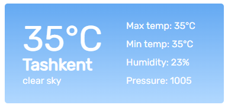

<h1>Виджет погоды</h1>

Посмотреть можно <a href="https://rasulnur.github.io/weather-widget/">тут</a>

Для получения данных о погоде использовал: <a href="https://openweathermap.org/api">OpenWeather API<a/>
 

Для получения данных местоположения использовал: <a href="https://ipgeolocation.io/">ipgeolocation.io/<a/>

